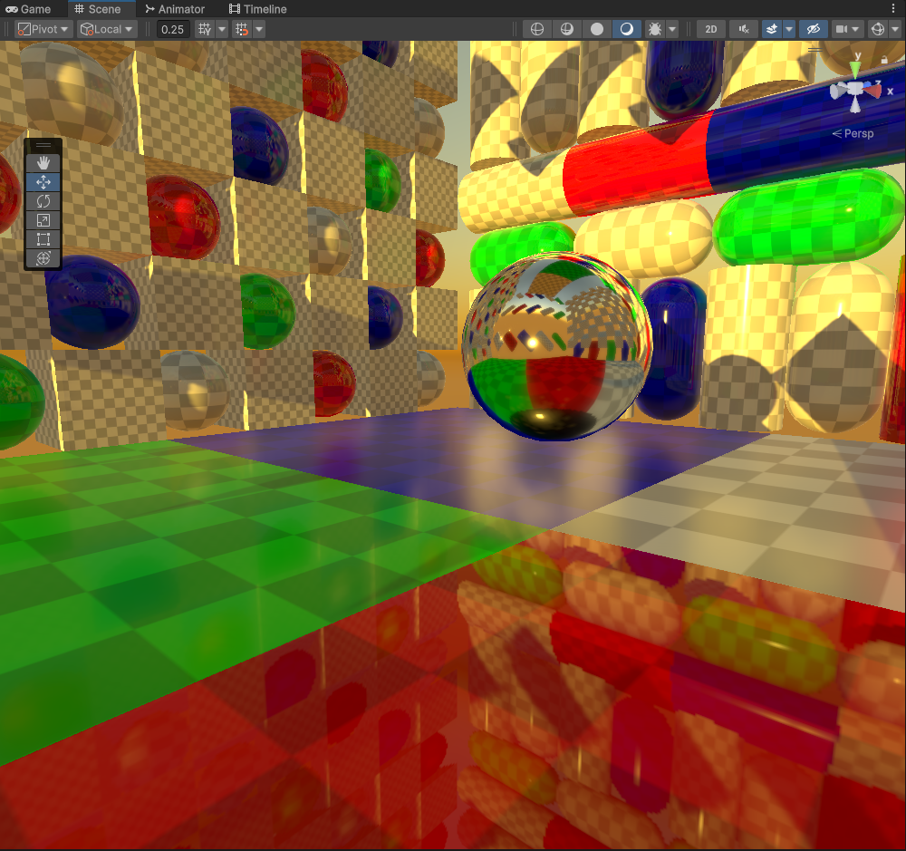

# Unity Cubemap Rendering

My implementations into de-coupling/reconstructing Unity Static and Realtime Reflection Probes. 

The goal is to create a more customized/configurable/optimized reflection probe renderer fitted with a number of unique features/solutions for a variety of scenarios.

#### Static Cubemap Rendering V1

- Cubemap 6 Pass Rendering
- Completely Static

#### Realtime Cubemap Rendering V1

- Cubemap 6 Pass Rendering
- Rendered Slices are Combined into a Tex2DArray via Compute Shader
- Mip Generation *(No Specular Convolution)*
- Real-time *(With Adjustable FPS Update Interval)*

#### Realtime Cubemap Rendering V2

- Cubemap 6 Pass Rendering
- Rendered Slices are Combined into a Tex2DArray via Graphics.CopyTexture
- Mip Generation *(No Specular Convolution)*
- Real-time *(With Adjustable FPS Update Interval)*

#### Realtime Cubemap Rendering V3

- Classic Cubemap 6 Pass Rendering
- Rendered Slices are Combined into a Tex2DArray via Compute Shader
- Mip Generation with GGX Specular Convolution
- Real-time *(With Adjustable FPS Update Interval)*

#### Realtime Cubemap Rendering V4

- Classic Cubemap 6 Pass Rendering
- Rendered Slices are Combined into a Tex2DArray via Compute Shader
- Mip Generation with GGX Specular Convolution
- Black Scene Object Buffer
- Real-time *(With Adjustable FPS Update Interval)*

#### Screenshots

