# Unity Cubemap Rendering

My implementations into de-coupling/reconstructing Unity Static and Realtime Reflection Probes. 

The goal is to create a more customized/configurable/optimized reflection probe renderer fitted with a number of unique features/solutions for a variety of scenarios. In addition, to also have greater control over the rendering of reflection probes for creative/performance reasons. This repo also has an implementation of tetrahedral environment rendering for more performant reflection probes than native.

Here is what I've implemented so far...

- **[Static Cubemap Rendering V1](#static-cubemap-rendering-v1)**
- **[Realtime Cubemap Rendering V1](#realtime-cubemap-rendering-v1)**
- **[Realtime Cubemap Rendering V2](#realtime-cubemap-rendering-v2)**
- **[Realtime Cubemap Rendering V3](#realtime-cubemap-rendering-v3)**
- **[Realtime Cubemap Rendering V4](#realtime-cubemap-rendering-v4)**
- **[Static Tetrahedral Cubemap Rendering V1](#static-tetrahedral-cubemap-rendering-v1)**
- **[Realtime Tetrahedral Cubemap Rendering V1](#realtime-tetrahedral-cubemap-rendering-v1)**
- **[Realtime Tetrahedral Cubemap Rendering V2](#realtime-tetrahedral-cubemap-rendering-v2)**

**NOTE:** One thing I would like to point out with many of these implementations, is that they have an additional ***Intermediate Cubemap*** render texture which is a 6 dimension Texture2DArray *(6 Texture2Ds)*. While this is the exact same technical makeup of a regular cubemap, you cannot write to a regular cubemap in a compute shader for some reason *(Unless if someone knows how to get around this or fix it in Unity, please let me know!)*. Since we need to often perform additional processing of the cubemap after all of it's faces are combined, we use this intermediate to do our processing. After processing is completed then we simply use Graphics.CopyTexture to transfer each of the slices and mips to the final native cubemap render texture. It would be ideal to work with the native cubemap render texture directly *(less memory usage)* but this is the workaround that has to be achieved.

#### Static Cubemap Rendering V1

This is a basic static implementation of rendering a cubemap in 6 passes. 

A camera is positioned at the center of the reflection probe boundary, with a field of view of 90 degrees. It is then rotated in 6 different axis, and a frame is captured from each axis. The rendered 6 faces are combined into a cubemap. 

Specular convolution on the Cubemap is achieved by utilizing unity's built-in texture tools.

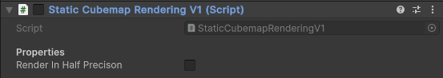

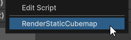
*Component Context Menu Functions*

#### Realtime Cubemap Rendering V1

This is a realtime implementation of cubemap rendering in 6 passes. 

A camera is positioned at the center of the reflection probe boundary, with a field of view of 90 degrees. It is then rotated in 6 different axis, and a frame is captured from each axis. The rendered 6 faces are combined into an intermediate cubemap render texture *(Texture2DArray)* using a compute shader. While copying each face into the intermediate cubemap, faces are re-oriented so they show up correctly. Then finally this intermediate render texture has it's data copied to a native cubemap render texture target. Lastly Mip-Maps get generated on the native cubemap render target.

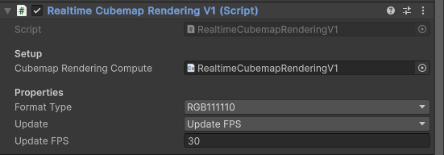

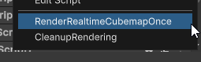
*Component Context Menu Functions*

There is configurable update logic on the component where you can choose to update the cubemap every frame, or update it for a set FPS interval, or choose to update it manually. 
In addition there is also an exposed Render Texture Format parameter, which gives you control over the memory usage by changing the format of the render textures. You can choose between RGBAFloat, RGBAHalf, RGB111110, or RGBA8.

***NOTE:** No specular convolution is done here, so materials/shaders sampling lower mip levels of the environment reflection will look too sharp and incorrect.*

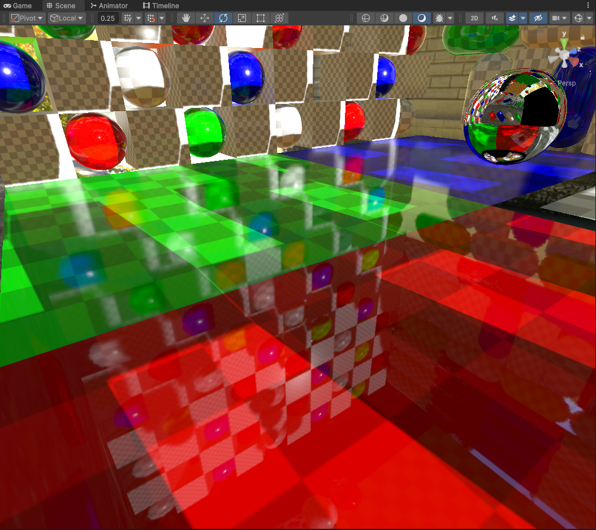

#### Realtime Cubemap Rendering V2

*Similar to **[Realtime Cubemap Rendering V1](#realtime-cubemap-rendering-v1)**, but the implementation is leaner and simpler. There is no compute shader used here to combine the faces.*

This is a realtime implementation of cubemap rendering in 6 passes. 

A camera is positioned at the center of the reflection probe boundary, with a field of view of 90 degrees. It is then rotated in 6 different axis, and a frame is captured from each axis. The rendered 6 faces are copied directly into the native cubemap render texture target using Graphics.CopyTexture. Then Mip-Maps get generated on the native cubemap render target.

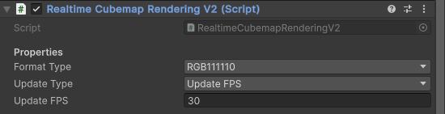

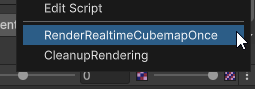
*Component Context Menu Functions*

There is configurable update logic on the component where you can choose to update the cubemap every frame, or update it for a set FPS interval, or choose to update it manually. 
In addition there is also an exposed Render Texture Format parameter, which gives you control over the memory usage by changing the format of the render textures. You can choose between RGBAFloat, RGBAHalf, RGB111110, or RGBA8.

***NOTE:** No specular convolution is done here, so materials/shaders sampling lower mip levels of the environment reflection will look too sharp and incorrect.*

#### Realtime Cubemap Rendering V3

*This is similar to **[Realtime Cubemap Rendering V1](#realtime-cubemap-rendering-v1)**, but the implementation includes GGX Specular Convolution.*

This is a realtime implementation of cubemap rendering in 6 passes. 

A camera is positioned at the center of the reflection probe boundary, with a field of view of 90 degrees. It is then rotated in 6 different axis, and a frame is captured from each axis. The rendered 6 faces are combined into an intermediate cubemap render texture *(Texture2DArray)* using a compute shader. While copying each face into the intermediate cubemap, faces are re-oriented so they show up correctly. Next Specular Convolution (GGX Specular) processing is performed on the lower mip map levels of the intermediate render texture. Then finally the intermediate render texture has it's data copied to a native cubemap render texture target.

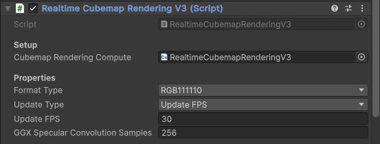

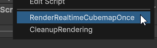
*Component Context Menu Functions*

There is configurable update logic on the component where you can choose to update the cubemap every frame, or update it for a set FPS interval, or choose to update it manually. 
In addition there is also an exposed Render Texture Format parameter, which gives you control over the memory usage by changing the format of the render textures. You can choose between RGBAFloat, RGBAHalf, RGB111110, or RGBA8.

In addition with specular convolution, you have control over how many samples are performed with GGX Specular Convolution. Low samples is faster but leads to noticable "fireflies" with bright sources. High samples are smoother and more accurate, but obviously a little slower.

#### Realtime Cubemap Rendering V4

*This is similar to **[Realtime Cubemap Rendering V3](#realtime-cubemap-rendering-v3)**, but the scene is mostly static, but the skybox is rendered in realtime.*

This is a semi-realtime implementation of cubemap rendering in 6 passes. 

A pre-processing/offline step is that a camera is captured at the center of the reflection probe boundary, with a field of view of 90 degrees. It is then rotated in 6 different axis, and a frame is captured from each axis. Each frame represents a sky-visibility buffer of the scene.

At runtime, a skybox mesh and material is rendered into the cubemap and composited with the sky-visibility faces. Then Specular Convolution (GGX Specular) processing is performed on the lower mip map levels of the intermediate cubemap render texture. Then finally the intermediate render texture has it's data copied to a native cubemap render texture target.

Effectively scene objects are precomputed, but the skybox is rendered and updated in realtime.

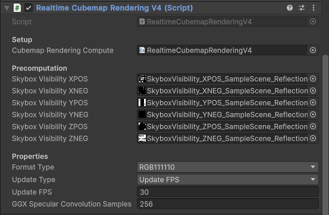

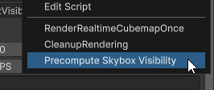
*Component Context Menu Functions*

There is configurable update logic on the component where you can choose to update the cubemap every frame, or update it for a set FPS interval, or choose to update it manually. 
In addition there is also an exposed Render Texture Format parameter, which gives you control over the memory usage by changing the format of the render textures. You can choose between RGBAFloat, RGBAHalf, RGB111110, or RGBA8.

In addition with specular convolution, you have control over how many samples are performed with GGX Specular Convolution. Low samples is faster but leads to noticable "fireflies" with bright sources. High samples are smoother and more accurate, but obviously a little slower.

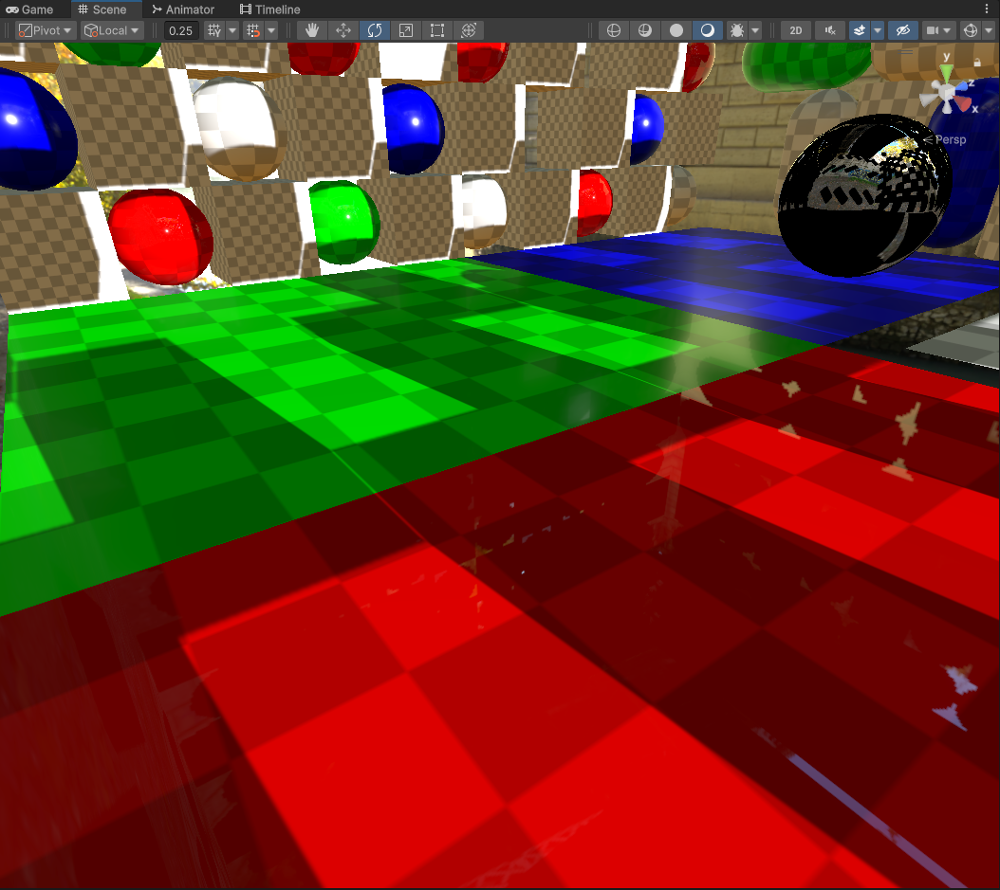

#### Static Tetrahedral Cubemap Rendering V1

This is a static implementation of tetrahedral cubemap rendering, which captures the scene in 4 passes instead of 6. The advantage of this approach is that less passes of the scene are required *(not useful in a static context)*, at the expense of less resolution.

A pre-processing/offline step required for this approach is generating a LUT from a compute shader that maps UVs from a cubemap into a tetrahedron map for a fast/efficent conversion of a tetrahedron map into a cubemap for use. There is also a LUT Supersampling property exposed on the component, which controls how precise the LUT is for mapping Cubemap Texel UVs to the Tetrahedron map at the expense of longer generation times. The higher the better the accuracy is, the lower it is the more pixelation can occur.

A camera is positioned at the center of the reflection probe boundary, and rotated in 4 different orentations. Each of the rendered 4 faces from each axis are combined into a tetrahedron map using a compute shader. This tetrahedron map is then converted into a regular 6 sided intermediate Texture2DArray cubemap. Then it is converted into a 2D Cubemap texture, which then gets reimported by Unity to turn into a native cubemap file.

Specular convolution on this Cubemap is achieved by utilizing unity's built-in texture tools just like **[Static Cubemap Rendering V1](#static-cubemap-rendering-v1)**.

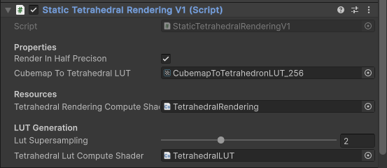

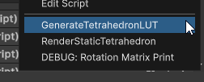
*Component Context Menu Functions*

#### Realtime Tetrahedral Cubemap Rendering V1

This is a realtime implementation of tetrahedral cubemap rendering, which captures the scene in 4 passes instead of 6. The advantage of this approach is that less passes of the scene are required which means better performance at runtime, at the expense of less resolution.

A pre-processing/offline step required for this approach is generating a LUT from a compute shader that maps UVs from a cubemap into a tetrahedron map for a fast/efficent conversion of a tetrahedron map into a cubemap for use. There is also a LUT Supersampling property exposed on the component, which controls how precise the LUT is for mapping Cubemap Texel UVs to the Tetrahedron map at the expense of longer generation times. The higher the better the accuracy is, the lower it is the more pixelation can occur.

A camera is positioned at the center of the reflection probe boundary, and rotated in 4 different orentations. Each of the rendered 4 faces from each axis are combined into a tetrahedron map using a compute shader. This tetrahedron map is then converted into a regular 6 sided intermediate Texture2DArray cubemap. Then the data from this intermediate cubemap is copied into a native cubemap render texture with Graphics.CopyTexture. Mips are generated on the final cubemap.

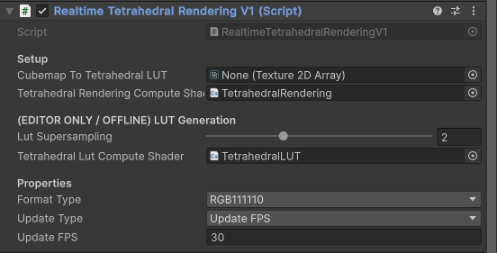

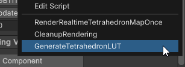
*Component Context Menu Functions*

There is configurable update logic on the component where you can choose to update the cubemap every frame, or update it for a set FPS interval, or choose to update it manually. 
In addition there is also an exposed Render Texture Format parameter, which gives you control over the memory usage by changing the format of the render textures. You can choose between RGBAFloat, RGBAHalf, RGB111110, or RGBA8.

***NOTE:** No specular convolution is done here, so materials/shaders sampling lower mip levels of the environment reflection will look too sharp and incorrect.*

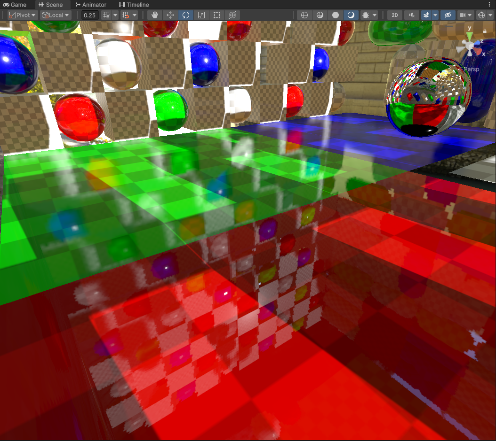

#### Realtime Tetrahedral Cubemap Rendering V2

This is a realtime implementation of tetrahedral cubemap rendering, which captures the scene in 4 passes instead of 6. The advantage of this approach is that less passes of the scene are required which means better performance at runtime, at the expense of less resolution.

A pre-processing/offline step required for this approach is generating a LUT from a compute shader that maps UVs from a cubemap into a tetrahedron map for a fast/efficent conversion of a tetrahedron map into a cubemap for use. There is also a LUT Supersampling property exposed on the component, which controls how precise the LUT is for mapping Cubemap Texel UVs to the Tetrahedron map at the expense of longer generation times. The higher the better the accuracy is, the lower it is the more pixelation can occur.

A camera is positioned at the center of the reflection probe boundary, and rotated in 4 different orentations. Each of the rendered 4 faces from each axis are combined into a tetrahedron map using a compute shader. This tetrahedron map is then converted into a regular 6 sided intermediate Texture2DArray cubemap. Specular Convolution (GGX Specular) processing is performed on the lower mip map levels of the intermediate cubemap render texture. Then finally the intermediate render texture has it's data copied to a native cubemap render texture target with Graphics.CopyTexture.

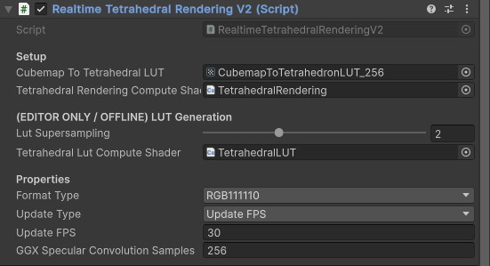

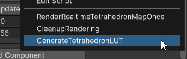
*Component Context Menu Functions*

There is configurable update logic on the component where you can choose to update the cubemap every frame, or update it for a set FPS interval, or choose to update it manually. 
In addition there is also an exposed Render Texture Format parameter, which gives you control over the memory usage by changing the format of the render textures. You can choose between RGBAFloat, RGBAHalf, RGB111110, or RGBA8.

In addition with specular convolution, you have control over how many samples are performed with GGX Specular Convolution. Low samples is faster but leads to noticable "fireflies" with bright sources. High samples are smoother and more accurate, but obviously a little slower.

### Credits / Resources
- GPU Pro 3060 Guide to Shadows: Chapter 3 (Tetrahedron Shadow Mapping)
- Pema99: Guidance with Tetrahedron Mapping